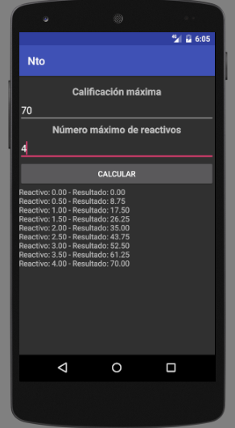

# NTE

Calcula la equivalencia en función de número introducido

Ejemplo:

```
- Si un examen vale 70% y contiene 4 preguntas, entonces calificación maxima =  70 y reactivos = 4,
 da el valor de la respuestas, en intervalos de 0.5
```

### Screenshot



### Download

Download 